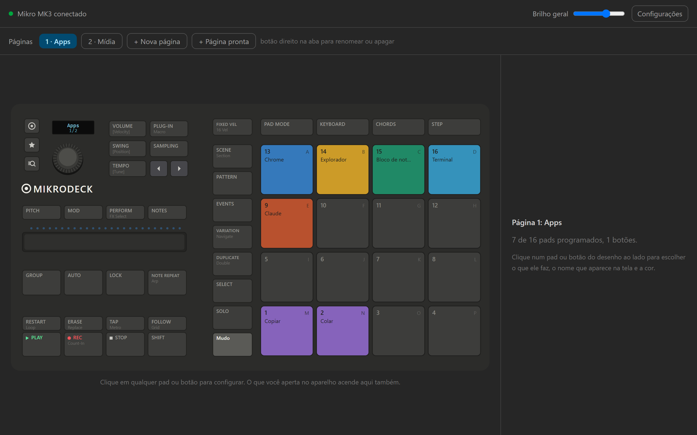
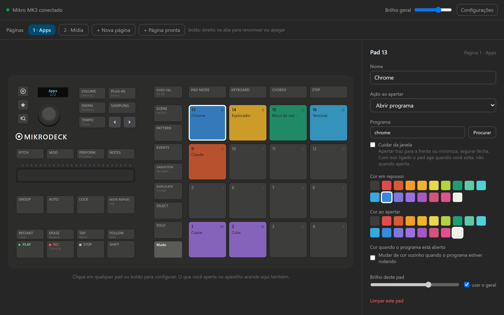
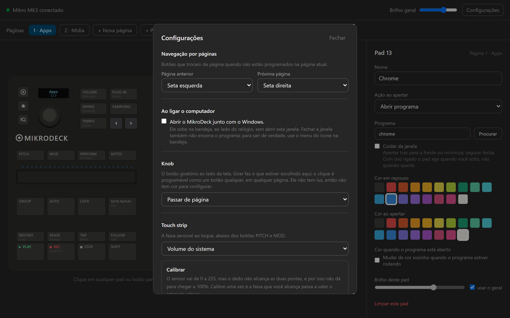
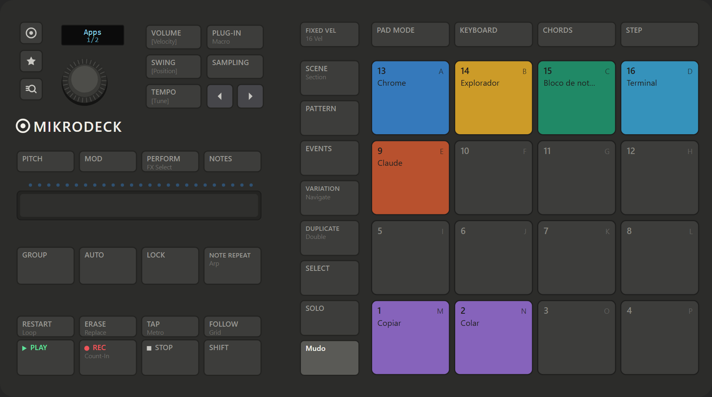

<h1 align="center">MikroDeck</h1>

<p align="center">
  <strong>Seu Maschine Mikro MK3 vira uma central de atalhos. E continua sendo um Maschine.</strong>
</p>

<p align="center">
  
  
  
  
  
  
  
</p>

> **English summary.** MikroDeck turns the Native Instruments Maschine Mikro MK3 into a Stream Deck style macro controller on Windows: 16 RGB pads per page, unlimited pages, all 39 buttons, knob, touch strip and the 128x32 screen, driven over raw HID with no NI driver in the loop. One physical button switches MikroDeck off and the unit goes back to being a plain Maschine for music. A built-in MCP server lets any MCP capable assistant configure the pads in plain language. The reverse engineered protocol, verified on real hardware, is in [docs/maschine-mikro-mk3-hid-protocol.md](docs/maschine-mikro-mk3-hid-protocol.md). Windows only. Version 1.0.0; installers on the [releases page](https://github.com/Thryki/mikrodeck/releases).

<p align="center">
  
</p>

---

## Índice

1. [Por que existe](#por-que-existe)
2. [O que você ganha](#o-que-você-ganha)
3. [Como é usar](#como-é-usar)
4. [Feito para conviver com o Maschine 2](#feito-para-conviver-com-o-maschine-2)
5. [Tudo que ele faz](#tudo-que-ele-faz)
6. [Ações disponíveis](#ações-disponíveis)
7. [Configure por conversa (MCP)](#configure-por-conversa-mcp)
8. [A configuração é um arquivo](#a-configuração-é-um-arquivo)
9. [Antes de começar: um passo, uma vez só](#antes-de-começar-um-passo-uma-vez-só)
10. [Por baixo do capô](#por-baixo-do-capô)
11. [Apoie o projeto](#apoie-o-projeto)
12. [Estado do projeto](#estado-do-projeto)
13. [Rodar do código](#rodar-do-código)
14. [Perguntas frequentes](#perguntas-frequentes)
15. [Como ajudar](#como-ajudar)
16. [Créditos](#créditos)

---

## Por que existe

Quem tem um Mikro MK3 conhece a cena: o aparelho fica ligado ao lado do teclado, bonito, e sem uso até a próxima sessão de música. São 16 pads RGB, 39 botões com LED, um knob, uma touch strip com 25 LEDs e uma tela. Tudo parado a maior parte do dia.

O MikroDeck usa esse tempo. Enquanto você não está produzindo, o Mikro vira uma central de utilidades: abre programa, dispara atalho, controla mídia, acende a luz da casa, troca de página com uma cor por estado. Na hora de fazer música, um botão desliga tudo e o aparelho volta a ser um Maschine comum.

Para chegar nisso foi preciso descobrir como o aparelho fala com o computador. O resultado está documentado em inglês, verificado no hardware, e aberto para quem quiser escrever o próprio software.

---

## O que você ganha

- **16 pads coloridos por página**, cada um com nome, ação e cor própria.
- **Páginas sem limite.** Uma para trabalho, uma para Spotify, uma para a casa, uma para o Claude.
- **Todos os 39 botões físicos programáveis**, mais o clique do knob.
- **Knob e touch strip** controlando volume, brilho ou página, com a strip acendendo como medidor.
- **A tela do aparelho** mostrando a página, o nome do pad que você encosta e a barra de volume.
- **Um botão liga e desliga tudo.** Desligado, o aparelho volta a ser um Maschine comum. O Maschine 2 continua funcionando como sempre.
- **Configure por conversa.** Servidor MCP embutido: peça para o seu assistente "coloca o Spotify no pad 1 em verde" e o pad acende em até um segundo.

Tudo isso falando HID direto com o aparelho, pela API padrão do Windows. Sem driver da Native Instruments rodando, sem WinUSB, sem Zadig.

---

## Como é usar

<p align="center">
  
  &nbsp;&nbsp;
  
</p>

1. Clique num pad no desenho. O painel da direita abre.
2. Dê um nome, escolha a ação, escolha as cores.
3. Pronto. Salvou sozinho e já acendeu no aparelho. Não tem botão de aplicar, não tem reiniciar.

O desenho espelha o hardware ao vivo, nos dois sentidos: o que você aperta no aparelho acende na tela, e o que você muda na tela acende no aparelho.

<p align="center">
  
</p>

Tem modo claro e modo escuro.

---

## Feito para conviver com o Maschine 2

Este é o ponto central do projeto. O MikroDeck não tira o seu Mikro da produção musical.

| Botão | Função de fábrica | Pode trocar? |
|---|---|---|
| Círculo (MASCHINE) | Liga e desliga o MikroDeck, sem fechar o programa | Sim |
| Estrela | Vai para a primeira página | Sim |
| Lupa | Abre a busca do Windows | Sim |

Com o MikroDeck ligado, os três ficam sempre acesos fraco, para você achar sem manual.

Para produzir música:

1. Aperte o círculo. O MikroDeck desliga sem fechar o programa.
2. Tudo apaga: pads, botões, tela. Nenhum pad executa ação.
3. O aparelho volta a ser um Maschine comum. Abra o Maschine 2 e trabalhe.
4. Só o círculo continua aceso. Aperte de novo e o MikroDeck volta como estava: página, cores, tela.

O mesmo liga e desliga existe como ação, para colocar em qualquer pad ou botão.

---

## Tudo que ele faz

### Pads

| Campo | O que controla |
|---|---|
| Nome | Aparece na tela do aparelho quando você encosta ou segura o pad |
| Ação | O que o pad faz ([lista completa](#ações-disponíveis)) |
| Cor em repouso | A cor de sempre |
| Cor ao apertar | A cor enquanto o dedo está no pad |
| Cor quando aberto | Para "abrir programa": o pad muda sozinho quando o programa está rodando |
| Brilho | De 0 a 3 por pad, além do brilho geral na barra de cima |

- **Toque leve mostra, aperto executa.** Encostar no pad sem apertar mostra o nome dele na tela e não faz nada. Usa um evento próprio do aparelho, que separa encostar de apertar.
- **Vigia de processos.** A varredura roda a cada 1,5 s, fora do caminho crítico, e troca a cor do pad quando o programa abre ou fecha.
- **Arrastar um pad em cima de outro** move a configuração. Destino ocupado abre uma escolha: substituir, trocar de lugar ou cancelar.
- **Gravador de atalho.** Clique em Gravar, segure as teclas juntas, solte. Modificador sozinho conta. Atalho que o Windows reserva, como `win+L`, precisa ser digitado.
- **Abrir programa** aceita executável, atalho `.lnk` do menu iniciar, nome curto (`chrome`, `notepad`) e arquivo por associação, com botão Procurar. Link sem `https` ganha o `https` sozinho.

### Páginas

| Recurso | Como funciona |
|---|---|
| Quantidade | Sem limite. Cada página tem seus 16 pads e seus botões físicos |
| Trocar | Setas `<` e `>` do aparelho (configurável), knob, touch strip ou ação de pad. Dá a volta nos dois sentidos |
| Abas | Botão direito na aba para renomear, duplicar e apagar |
| Páginas prontas | Spotify, Claude, Casa e Trabalho entram com um clique, no fim da lista, sem sobrescrever nada |

### Botões físicos

| Recurso | Como funciona |
|---|---|
| Programáveis | Os 39 botões, por página, mais o clique do knob (botão `knob`, sem LED) |
| LED | Botão é monocromático: acende quando tem ação, apaga quando não tem |
| Reservados | Dois botões ficam reservados para trocar de página. O painel explica por quê |

### Knob

| Girar faz | Detalhe |
|---|---|
| Passar de página | Padrão de fábrica |
| Volume do Windows | 2% por passo |
| Brilho dos pads | |
| Rolar a janela | Como a roda do mouse |

### Touch strip

| Recurso | Como funciona |
|---|---|
| O que controla | Volume do Windows (padrão), brilho dos pads, escolher a página pela posição do dedo, ou nada |
| Medidor | Os 25 LEDs acendem mostrando o valor do que ela controla |
| Calibração | Em Configurações, com leitura ao vivo, para ajustar a faixa que o dedo alcança |

### Tela do aparelho (128x32)

| Situação | O que aparece |
|---|---|
| Repouso | Nome da página em corpo grande, número embaixo |
| Encostar ou segurar um pad | Nome do controle |
| Mexer em volume ou brilho | Barra do valor |
| Parado por um tempo | Descanso com texto correndo. Padrão 90 s, texto "MikroDeck", mínimo 5 s |

### Cuidar da janela

Opção por pad, para programa e para link. Um pad vira o controle completo daquela janela.

| Gesto | Programa | Link |
|---|---|---|
| Toque | Abre, ou traz para a frente. Já na frente, minimiza | Abre, ou vai para a janela do site |
| Toque duplo (menos de 350 ms) | Fecha o programa | Maximiza ou restaura |
| Segurar (700 ms) | Maximiza, e desmaximiza se já estiver | Abre outra janela do link |

### Interface e bandeja

| Recurso | Como funciona |
|---|---|
| Espelho ao vivo | O que você aperta no aparelho acende no desenho. O que muda na interface salva sozinho e aplica no aparelho, sem reiniciar |
| Temas | Modo claro e escuro |
| Bandeja | Fechar a janela esconde. Sair de verdade é pelo menu da bandeja. Checkbox para subir junto com o Windows |
| Reconexão | Religou o cabo, voltou sozinho |
| Diagnóstico | Aparelho conectado, páginas, pads e botões configurados, versão, caminho da config |
| Manutenção | Testar LEDs. Abrir pasta da config. Restaurar configuração de exemplo (a antiga vira `.bak`) |

---

## Ações disponíveis

| Ação | Detalhe |
|---|---|
| Abrir programa | Executável, atalho `.lnk`, nome curto, com argumentos |
| Abrir link | No navegador padrão, `https` automático |
| Rodar comando | Uma linha de shell |
| Atalho de teclado | `ctrl`, `shift`, `alt`, `win`, `f1` a `f24`, letras, números, setas, `enter`, `tab`, `esc` e outras |
| Mídia | Tocar e pausar, próxima faixa, faixa anterior, parar, aumentar volume, diminuir volume, mudo |
| Próxima página | Dá a volta no fim |
| Página anterior | Dá a volta no começo |
| Ir para página | Por número |
| Ligar e desligar o MikroDeck | Pausar e retomar |
| Home Assistant | Serviço `dominio.servico` + entidade, por exemplo `light.toggle` em `light.sala` |
| Requisição HTTP | GET, POST, PUT, cabeçalhos e corpo. Cobre webhook e qualquer serviço que aceite uma chamada |
| Tocar um som | Um sample no pad: arquivo escolhido ou gravado pelo microfone, com envelope e volume próprios |
| Nada | Pad decorativo ou vazio |

### Páginas prontas

| Página | O que traz |
|---|---|
| **Spotify** | Controle de mídia. Usa os botões físicos PLAY, STOP, RESTART e TAP |
| **Claude** | Atalhos para o dia a dia com o Claude |
| **Casa** | Exemplos de Home Assistant, para trocar pelas suas entidades |
| **Trabalho** | Copiar, colar, desfazer, print, áreas de trabalho, bloquear |
| **Navegador** | Abas, histórico, downloads, zoom e tela cheia |
| **Windows** | Encaixar janelas, trocar de app, gravar a tela, área de transferência, emoji |
| **Samples** | Dezesseis pads prontos para receber som, uma cor por fileira |

E há sempre a opção **Vazia**, que cria uma página em branco.

### Casa e web

**Home Assistant.** Endereço e token de acesso de longa duração uma vez, em Configurações. Depois qualquer pad chama um serviço. O token fica em texto puro no `config.json`, e a interface avisa. Use um token só para isso.

**Requisição HTTP.** Para webhook e qualquer serviço que aceite uma chamada: GET, POST, PUT, cabeçalhos e corpo.

---

## Configure por conversa (MCP)

O MikroDeck traz um servidor [MCP](https://modelcontextprotocol.io) embutido: um binário separado, `mikrodeck-mcp.exe`, falando JSON-RPC por stdin e stdout. Qualquer assistente que fale MCP configura os pads em português. A mudança cai no arquivo de config, o motor vigia o arquivo e aplica em até um segundo. Sem reiniciar nada. Provado de ponta a ponta, com foto do pad aceso.

A tela de Configurações entrega o comando pronto para **Claude Code**, **Cursor** e **Codex**, e o bloco JSON para **Claude Desktop**, **Windsurf** e **Zed**. Para o Claude Code ele tem esta cara:

```bash
claude mcp add mikrodeck -- "<pasta do MikroDeck>\mikrodeck-mcp.exe"
```

Depois, na conversa:

> cria uma página chamada Edição com os atalhos do Photoshop que eu mais uso, e deixa o pad de salvar verde

<details>
<summary>As 14 ferramentas</summary>

| Grupo | Ferramentas |
|---|---|
| Ler e consultar | `ler_configuracao`, `ajuda_acoes`, `listar_cores`, `listar_botoes`, `listar_paginas_prontas` |
| Páginas | `criar_pagina`, `renomear_pagina`, `apagar_pagina`, `adicionar_pagina_pronta` |
| Pads | `definir_pad`, `limpar_pad` |
| Botões | `definir_botao`, `limpar_botao` |
| Ajustes | `definir_ajustes` (knob, strip, descanso de tela e afins) |

</details>

---

## A configuração é um arquivo

| O quê | Detalhe |
|---|---|
| Onde | `%USERPROFILE%\.mikrodeck\config.json` |
| Formato | JSON legível, editável à mão |
| Vigia | O motor vigia o arquivo e aplica qualquer mudança em até um segundo |
| Gravação | Atômica: temporário e depois rename. Uma queda no meio não corrompe nada |
| Primeiro uso | Cria uma config de exemplo com duas páginas, **Apps** e **Mídia** |

Interface, MCP, outro programa ou editor de texto: tudo cai no mesmo arquivo, e o motor aplica sozinho.

---

## Antes de começar: um passo, uma vez só

O Mikro MK3 sai de fábrica aceitando leitura, mas ignorando comando de LED. Para liberar:

1. Conecte o aparelho.
2. Abra o **Maschine 2 como administrador** uma vez.
3. Pode fechar.

Isso grava um estado permanente dentro do aparelho. Depois disso ele aceita comando de LED de qualquer processo, a qualquer momento, sem sequência de inicialização nenhuma.

| Pergunta | Resposta |
|---|---|
| Quantas vezes | Uma por aparelho. Não é por sessão nem por conexão |
| Sobrevive a desconectar o cabo | Sim |
| Sobrevive a reiniciar o Windows | Sim |
| Precisa do Maschine 2 aberto depois | Não. Nada da NI roda junto com o MikroDeck |
| E sem o passo | Pads não acendem. Leitura de pads, botões, knob e strip funciona mesmo assim |

O comando exato que o Maschine 2 grava ainda não foi encontrado. Se você quiser ajudar a tirar esse pré-requisito, veja [Como ajudar](#como-ajudar). A prova de que o estado fica no aparelho está em [Por baixo do capô](#por-baixo-do-capô).

---

## Por baixo do capô

### O achado que define tudo

O Mikro MK3 **não manda MIDI pela USB**. É HID puro. O "modo MIDI" é emulado pelo driver da NI. Falar HID direto dá acesso a tudo: LEDs dos pads, botões e strip, escrita na tela, leitura de pads com pressão de 0 a 4095, botões e knob. Tudo pela API HID padrão do Windows, sem trocar driver.

O protocolo está documentado em inglês e verificado no hardware: [docs/maschine-mikro-mk3-hid-protocol.md](docs/maschine-mikro-mk3-hid-protocol.md).

| Item | Valor |
|---|---|
| VID / PID | `0x17CC` / `0x1700` |
| Entrada `0x01` | Botões, knob e touch strip |
| Entrada `0x02` | Pads, com pressão de 0 a 4095 |
| Saída `0x80` | LEDs, 81 bytes: 39 botões, 16 pads, 25 LEDs da strip. Byte = `(cor << 2) \| brilho`. 17 cores mais apagado |
| Saída `0xE0` | Tela 128x32, 1 bit por pixel, dois pacotes de 265 bytes, bitmap invertido |
| Limite de escrita | Cerca de 31 escritas por segundo. Passar disso corrompe pacote |
| Buffer de leitura | 256 bytes. Com 64 o pacote grande some sem erro |

Cinco teorias erradas ficaram registradas no doc para ninguém repetir: tamanho do pacote, modo MIDI, sequência de inicialização, janela de tempo e corrida de abertura. Ler antes de tentar de novo economiza dias.

### A prova do pré-requisito

Cabo religado fisicamente, nada da NI aberto, uma escrita crua do report `0x80` sem leitura nenhuma, 9 ms depois de abrir o aparelho. Acendeu tudo, com a tela apagada. A tela apagada é a prova de que nenhum software da NI participou.

### Como se verifica LED sem se enganar

Olho não serve: a exposição automática da câmera faz LED apagado parecer aceso. O método usado aqui é uma webcam apontada para o aparelho, foto automática a cada teste e medição numérica de brilho por região, com desconto de exposição. Os scripts estão em `scripts/`.

O desenho do aparelho na interface passou pelo mesmo rigor: medido contra uma foto em alta resolução, em quatro rodadas de avaliação, até chegar em 9,4 de 10.

### Arquitetura

| Pasta | O que é |
|---|---|
| `mikrodeck/motor` | Núcleo em Rust, biblioteca + binário: HID, estado, ações, tela, vigias, serviço residente |
| `mikrodeck/app` | App Tauri 2 com React e Tailwind. Bandeja, interface, ponte com o motor |
| `mikrodeck/mcp` | Servidor MCP, binário separado |
| `docs/` | Protocolo HID em inglês, arquitetura, spec da interface, diário do spike |
| `scripts/` | Verificação por câmera, medição de brilho, prints deste README |

Módulos do motor:

| Módulo | Responsabilidade |
|---|---|
| `hid` | Abre o aparelho, thread de leitura bloqueante, thread de escrita a 30 Hz. Nada fora dele toca o HID |
| `estado` | Páginas, pads apertados, cor por estado. Recebe evento, devolve reação. Não fala com HID nem executa ação |
| `acoes` | Executa em thread própria. Nunca trava a leitura do aparelho |
| `render` | Framebuffer da tela, fonte 5x7, compositor de cenas. Envia só quando muda |
| `luz` | Animador de LED, com orçamento de escritas testado |
| `servico` | Serviço residente. Reconecta sozinho, vigia o arquivo de config |
| `config` | JSON em disco, gravação atômica |

Regras que valem para sempre:

- **Caminho crítico em Rust.** `pad -> HID -> estado -> ação`, sem passar pela interface. Ações rodam em fila separada.
- **Uma escrita por tique.** O frame de LED vai na frente, e as duas metades da tela vão espaçadas em 12 ms.
- **A touch strip como medidor vive no mesmo frame de LED.** Custo extra de escrita: zero.
- **Por fora, pad é o número impresso no aparelho** (1 a 16). A ordem bruta fica escondida no `hid`.
- **Testável sem aparelho.** Estado, compositor da tela e animador de luz têm testes próprios: **219 no motor e 15 no MCP**, todos passando.
- **Interface sem aparelho.** `npm run dev` abre a interface num navegador comum, com dados de demonstração. É assim que os prints deste README são tirados.

Mais em [docs/arquitetura.md](docs/arquitetura.md).

---

## Apoie o projeto

O MikroDeck é livre e sempre vai ser. Ele nasceu de engenharia reversa feita à
mão num aparelho cujo protocolo a fabricante nunca publicou, e todo o que foi
descoberto está aqui, aberto, em
[docs/maschine-mikro-mk3-hid-protocol.md](docs/maschine-mikro-mk3-hid-protocol.md).

Se ele te serviu, você pode ajudar a manter o trabalho de pé pelo botão
**Sponsor** aqui no repositório, ou pelo botão **Apoiar o projeto** dentro do
app, em Configurações.

Ajuda que não custa nada também vale: abrir uma issue com um bug, contar em qual
Windows funcionou, ou mandar uma página pronta que você montou.

## Estado do projeto

| Item | Situação |
|---|---|
| Versão | **1.0.0**, a primeira estável |
| Plataforma | Só Windows (SendInput, Core Audio, EnumWindows, HID do Windows) |
| Testes | 219 no motor, 15 no MCP, todos passando |
| Download | Instalador e MSI na [página de releases](https://github.com/Thryki/mikrodeck/releases) |
| Licença | GPL-3.0 |

**O que entrou na 1.0**

- Pads, páginas, botões físicos, knob, touch strip e a tela, tudo configurável.
- Samples de áudio nos pads: carregar arquivo ou gravar pelo microfone, com
  envelope de plugin (atraso, ataque, retenção, decaimento, sustentação,
  liberação e as duas curvas) e forma de onda desenhada.
- Home Assistant: descobre os dispositivos da casa e monta a página sozinho.
- Luz dos pads no descanso, com cinco modos.
- Escolher programa pelo nome, do menu Iniciar, apps da Microsoft Store inclusive.
- Cuidar da janela pelo pad: um toque alterna, segurar maximiza, dois toques fecham.
- Servidor MCP, para configurar por conversa em qualquer assistente que fale MCP.

<details>
<summary>O que ainda não existe</summary>

- macOS e Linux.
- Perfis (conjuntos de páginas por contexto) e importar/exportar em JSON. Hoje é uma config única com páginas.
- Sons de sistema ao apertar, subir e descer volume ou mudo. O que existe é o sample no pad.
- Animação de boot ao conectar.
- Vigia de janela em foco e de volume. Só existe a vigia de processos, e a cor de "aberto" vale para a ação de abrir programa.
- Limiar de pressão configurável. A pressão é lida, mas o toque leve usa o evento de encostar do próprio aparelho.
- Token do Home Assistant em cofre seguro. Fica em texto puro no `config.json`, e a interface avisa.
- O desenho na interface acompanhar a animação de LED ao vivo.
- Plugins (VST3 ou CLAP) nos samples.
- Sobrepor vozes no mesmo pad e grupos de corte.

</details>

---

## Rodar do código

### Pré-requisitos

| Ferramenta | Versão |
|---|---|
| Rust | 1.85 ou mais novo (o motor usa edition 2024) |
| Node.js | Atual |
| Tauri 2 no Windows | Build Tools do MSVC e WebView2 |

### Comandos

| Quero | Comando |
|---|---|
| Rodar o app em desenvolvimento | `cd mikrodeck/app && npm install && npm run tauri dev` |
| Interface sem aparelho (modo demonstração) | `cd mikrodeck/app && npm run dev` e abrir `http://localhost:1420` |
| Motor sozinho, sem interface | `cd mikrodeck/motor && cargo run` (SHIFT + STOP no aparelho encerra) |
| Testes do motor | `cd mikrodeck/motor && cargo test` |
| Testes do MCP | `cd mikrodeck/mcp && cargo test` |
| Servidor MCP | `cd mikrodeck/mcp && cargo build --release` gera `mikrodeck-mcp.exe` |
| Build de release | `cd mikrodeck/app && npm run tauri build` |
| Prints do README | Com o `npm run dev` de pé: `node scripts/prints-readme.js` grava os quatro PNGs em `docs/imagens` |

### Do zero ao pad aceso

1. Destrave o aparelho ([um passo, uma vez só](#antes-de-começar-um-passo-uma-vez-só)).
2. Suba o app: `cd mikrodeck/app && npm install && npm run tauri dev`.
3. Clique num pad no desenho, dê um nome, escolha uma ação e uma cor.
4. Olhe para o aparelho. O pad já está aceso. Aperte, e a ação roda.

A config de exemplo já vem com duas páginas, Apps e Mídia.

### Avisos que economizam tempo

- Build de release é sempre pelo `npm run tauri build`. `cargo build --release` direto no `src-tauri` gera um binário apontando para o servidor de desenvolvimento.
- Para o MCP entrar no instalador, copie `mikrodeck-mcp.exe` para `mikrodeck/app/src-tauri/binarios/`. A pasta é ignorada pelo git e referenciada como recurso no `tauri.conf.json`.
- Antes de buildar, derrube qualquer `mikrodeck-mcp.exe` rodando. Senão o arquivo em `target/release` fica travado.

### Mais documentação

| Doc | Conteúdo |
|---|---|
| [docs/maschine-mikro-mk3-hid-protocol.md](docs/maschine-mikro-mk3-hid-protocol.md) | Protocolo HID completo, em inglês |
| [docs/arquitetura.md](docs/arquitetura.md) | Módulos do motor |
| [docs/spike-hid.md](docs/spike-hid.md) | Diário do spike no hardware, com as teorias que caíram |
| [docs/ui-spec.md](docs/ui-spec.md) | Especificação da interface |
| [docs/animacoes.md](docs/animacoes.md) | Animações de LED (em andamento) |

---

## Perguntas frequentes

**Os pads não acendem.**
Faça o passo do Maschine 2 como administrador, uma vez. Está em [Antes de começar](#antes-de-começar-um-passo-uma-vez-só).

**Preciso do Maschine 2 instalado?**
Só para o passo único de destravar o aparelho. Depois disso nada da NI roda junto com o MikroDeck.

**Dá para usar o Maschine 2 sem fechar o MikroDeck?**
Sim. Aperte o círculo. O MikroDeck desliga, o aparelho volta a ser um Maschine comum, e o círculo continua aceso para você voltar.

**O aparelho não aparece.**
Configurações, Diagnóstico, diz se ele foi encontrado. Desconecte e conecte o cabo. O MikroDeck reconecta sozinho.

**Fechei a janela e o MikroDeck sumiu.**
Ele está na bandeja, ao lado do relógio. É lá que ele precisa ficar para os pads funcionarem. Sair de verdade é pelo menu da bandeja.

**Quero começar de novo.**
Configurações, Restaurar configuração de exemplo. A antiga vira `.bak`.

**Funciona no Mac ou no Linux?**
Não. Só Windows por enquanto.

**Tem instalador?**
Tem, na [página de releases](https://github.com/Thryki/mikrodeck/releases): um
`.exe` de instalação e um `.msi`. Também dá para compilar do código.

---

## Como ajudar

Tem um Mikro MK3 na mesa? Então você já pode ajudar. O projeto é de uma pessoa só e o aparelho está em muitas mesas.

| O quê | Como | Para quem |
|---|---|---|
| **Tirar o pré-requisito** | Descobrir o comando que o Maschine 2 grava no aparelho ao rodar como administrador. Interceptar as chamadas dele (API Monitor, captura USB ou parecido) e reproduzir com uma escrita crua. Isso remove o único passo manual do MikroDeck | Quem gosta de engenharia reversa |
| **Testar no seu aparelho** | Rodar o roteiro [do zero ao pad aceso](#do-zero-ao-pad-aceso) no seu Mikro MK3 e contar o que aconteceu. Cada aparelho a mais confirmando o protocolo vale muito | Qualquer dono do aparelho |
| **Provar as animações** | O módulo `luz` existe e passa nos testes. Falta a foto: rodar com a câmera e a medição de brilho | Quem tem o aparelho e paciência |
| **macOS e Linux** | O HID é padrão. As ações usam API do Windows (`SendInput`, Core Audio, `EnumWindows`). Portar o módulo de ações abre as outras plataformas | Quem desenvolve em Rust fora do Windows |
| **Sons ao apertar** | Não existe ainda. Um som curto por pad, sem entrar no caminho crítico | Quem gosta de áudio |
| **Páginas prontas** | Mais páginas de um clique: DAW, edição de vídeo, OBS, o que você usa. Um conjunto de 16 pads que resolve o seu dia pode resolver o de outra pessoa | Qualquer pessoa |
| **Protocolo** | Revisar, completar e corrigir o documento em inglês | Quem mexe com HID |
| **Software próprio** | Usar o protocolo documentado para fazer outra coisa com o aparelho. Conta o que fez | Todo mundo |

Abra uma issue com bug, ideia ou dúvida. Foto e vídeo do aparelho ajudam mais que descrição. Correção pequena e página pronta podem ir direto em pull request; para código grande, abra uma issue antes para alinhar.

E deixe uma estrela. Ajuda o projeto a chegar em quem tem o mesmo aparelho parado na gaveta.

---

## Créditos

- [pymikro](https://github.com/flokapi/pymikro), de flokapi, licença **LGPL-2.1**:
  implementação em Python do Mikro MK3, o mapa que guiou a reescrita em Rust.
  Nenhuma linha foi copiada; o que veio de lá foi o entendimento dos pacotes,
  e cada byte foi reconfirmado no aparelho. A LGPL-2.1 permite passar para a
  GPL-3.0, então não há conflito com a licença deste projeto.
- [Notas de engenharia reversa da família MK3](https://gist.github.com/ktemkin/89253ecf10c5078f47607776564de83b),
  de ktemkin: um gist sem licença declarada, usado como referência de formato.

Tudo que este repositório afirma sobre o protocolo foi verificado no aparelho
físico, e o que foi verificado está em
[docs/spike-hid.md](docs/spike-hid.md) e em
[docs/maschine-mikro-mk3-hid-protocol.md](docs/maschine-mikro-mk3-hid-protocol.md).

Maschine e Native Instruments são marcas dos seus donos. Este projeto não tem ligação com a Native Instruments.

Feito por **Thryki**. Motor, app, servidor MCP e engenharia reversa do protocolo.

Licenciado sob a **GPL-3.0**. Você pode usar, estudar, modificar e
redistribuir; quem distribuir uma versão modificada precisa abrir o código dela
também. Veja [LICENSE](LICENSE).

Copyright © 2026 Davi Reis Aragão (Thryki).
